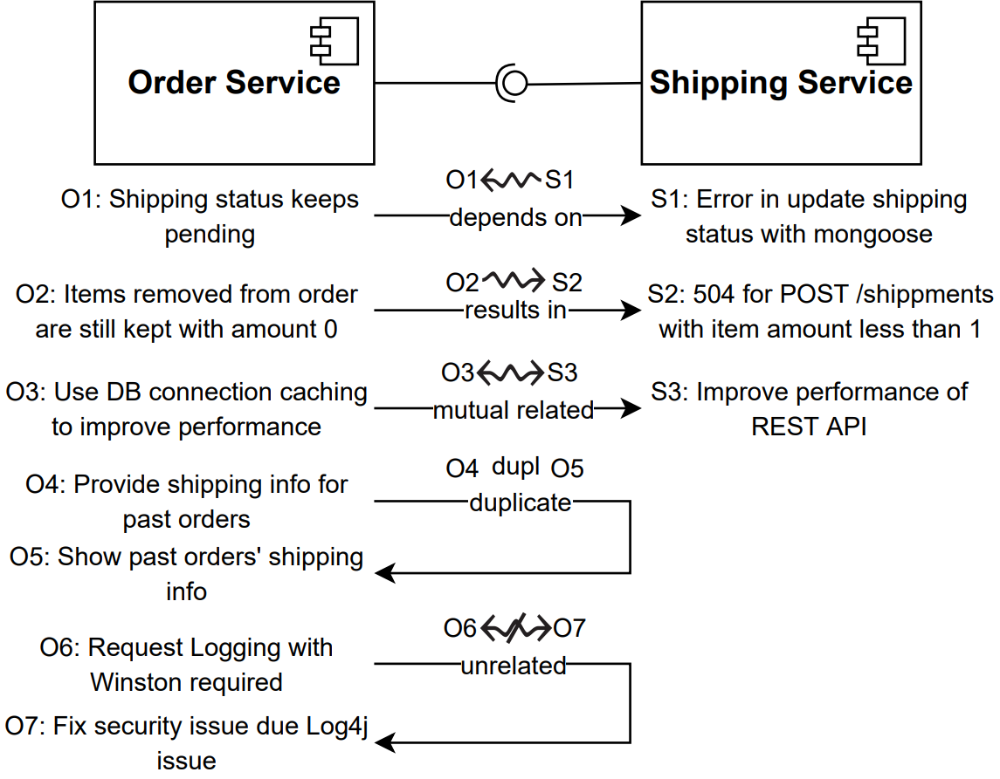
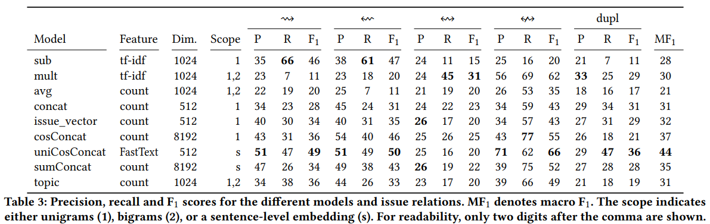

# Issue Relations

## Introduction

When developing microservice in large, a bug/issue occurring in one component might affect another component (a so called cross-component issue).
This might not be a problem for small software architectures, but when developing software in large, this poses a serious threat due to the developers not knowing every bug of every component.

## Problem Statement

Because of this threat, a automatic issue-relation classifier is needed, to automatically predict, which issues are dependent on other issues.

## Our Solution

We formulate issue relation detection as a pair-wise text classification task in which we predict the following classes for issues A and B:

* **(1) A depends on B** The issue A can not be solved before another issue B has already been solved, due to the root cause of issue A originating in issue B.
* **(2) A results in B** The issue B is a issue caused by issue A
* **(3) mutual related** The two issues stand in a relation and thus describe a similar Problem, but the direction is unclear and miight be from a third issue.
* **(4) duplicate** Two issues describe the same problem
* **(5) unrelated** Two issues that do not stand in a relation

With concrete issues this looks like this:

And for those relations we provide a microservice based solution, which automatically creates a issue relation graph for the given issues.

## How We Addressed the Issue

### Annotation

To annotate the collected issue pairs we conducted a study, where we asked two participants to annotate our issues. Each annotator received a list with the issue-pair URLs. Based on this, they went manually through the [repositories](./scraped_files/allRepos.txt) to find mentions between the issues and classify them. Based on this we measured the Cohens kappa agreement betwen the two annotators which is 0.705, and henceforth is a substential agreement according to Landis and Koch.

### Scraper

The issue data (head, body, url) as well as the comments (body, date) were scraped from the repositories using the [scraping tool](./scraping_tool/).
In addition to that, the date of the relation was also collected to enable a matching of which comments were earlier and which later.
[issue scraper](./scraping_tool/issueScraper/app.ts) is used to collect the issues.
[comment scraper](./scraping_tool/commentScraper/commentScraper.ts) is used to collect the comments.
[comment matcher](./scraping_tool/commentDateMatcher/reviewCommentDates.ts) appends the mention dates onto the relations.\

All those tools require node.js and can be run using the command *node [fiename]*.

### Creating Issue Relations

Both, the issues and their relation were then transformed into tuples *(IssueA, issueB, relation)* (the relation is a vector of the class and the issues themselves consist out of a concatenation of the issue title, body and the comments leading up to the date of the mention).Also, the unrelated issues were generated by creating the issue graph (unconnected a graph consisting out of smaller connected "sub" graphs) and pairing issues from different "sub" graphs together.Image of a connected sub-graph:

This ensures, that there is no transitive relation between the issues.

> A transitive relation can be seen in the picture above (the three green nodes at the top connected by "dupl." edges).
> lets call them A,B,C
> now A is a duplicate of B, and B is a duplicate of C
> Then A and C are probably also duplicates of each other, even though there is no edge between them.

### Relation Classifier

The classifier itself consists out of two parts, a vectoriser, which encodes the document in form of a vector and the classifier itself, for which we created a siamese like neuronal network.\

#### Vectoriser

For the vectoriser we tested several bag of words configurations like different vocabulary sizes, un- and bigrams as well as tf-idf weighting.
In addition to that we tested fast text, and GloVe as word-level embeddings, combined using averaging them and usif as a weighted sentence/document representation.
Further, we used/tested the document embeddings obtained using the universal sentence encoder.

#### Classifier

For the classifier we created a siamese network, which takes in two inputs and creates an outputs the issue relation class.
In order to evaluate the performance and what model works, we tested and evaluated several models.
Using the Keras tuner to retrieve deep neuronal networks out of the models, did not lead to a improvement.

## Microservice

The microservice consists out of a [vectorsation service](./microservice/vectoriser/) and a [classification service](./microservice/classifier/).Both communicate over the following REST requests in a custom bridge network:There are 3 entrypoints for requests, the vectorise_issues and the vectorise_and_classify_issues entrypoint, the  for the Vectorisation service and the classify_documents one for the classification service.
For both services only the issue texts are required.The classification service on the other hand requires the issueTexts as well as the vectorisedIssues.

> http://localhost:5000/vectorise_issues
> {"issueTexts": ["huehu", "aber ich bin ein doc", "anderes Document"]}

> http://localhost:5000/vectorise_and_classify_issues
> {"issueTexts": ["huehu", "aber ich bin ein doc", "anderes Document"]}

> http://localhost:5001/classify_documents

The vectoriser uses the public available universal sentence encoder to create document embeddings, because it achieved the best results in combined with our _UniCosConcat_ classifier.
And the classification service uses the _UniCosConcat_ model, and applies it onto all the relations needed to obtain the issue graph.
For the relations: 0 = unrelated; 1 = duplicated, 2 = <=>; 3 = <=; 4 = =>

## Instructions

### Instructions for the Microservice

The microservice can be started using docker-compose.
It requires docker, as well as compose.
With the folder, the microservice can be started using the command *docker-compose up*.
However, the [universal sentence encoder v4](https://tfhub.dev/google/universal-sentence-encoder/4) haas to be downloaded in advance and placed into the *kubernetes_microservice/container1/app* folder.
Because in this folder the docker compose searches for a file named *universal-sentence-encoder_4.tar.gz*.
After the images have been built using compose, they can be used in the kubernetes cluster.
**IMPORTANT: We use the local images build using compose for our pods therefore the compose service has to be started in advance or the images have to built manually on advance**
Simply run **kubectl append -f kompose.yaml** to push the images into the cluster.
The microservice uses the following libraries: *numpy==1.19.2*, *tensorflow==2.5.0*, *httpx==0.18.2* and is build on top of the *tiangolo/uvicorn-gunicorn-fastapi:python3.8-2021-06-09* docker images, which creates a Uvicorn ASGI server for asynchronous python web code, in addition to Gunicorn, which manages Uvicorn and FastAPI in a single container.
Important to note is, that the *MAX_WORKERS* environment variable can be set in the DOCERFILEs to enable multiple workers (or one per CPU).

### Instructions for the Jupiter Notebooks files

The Jupiter Notebooks files can be started by importing them into Google Collab.
Google Collab offers most the packages runs the code in the browser.
*https://colab.research.google.com/*

## Model performances

## Directory Structure

| Folder                                                              | Explanation                                                                                       |
| :------------------------------------------------------------------ | :------------------------------------------------------------------------------------------------ |
| ISSUE_RELATIONS                                                     | This is the main folder                                                                           |
| ├──[calculate_kappa](./calculate_kappa)                             | Here lies the Kappa script to document the Kohens Kappa between the annotators                    |
| ├──[classifier](./classifier)                                       | This folder contains the code to generate the classifiers                                         |
| ├──[generate_data](./generate_data)                                 | Here lies the logic to generate issue relations from the scraped data                             |
| ├──[graph_plotting](./graph_plotting)                               | This folder contains the script for plotting issue relation graphs                                |
| ├──[issue_relations](./issue_relations)                             | This folder contains the data gathered by the participants                                        |
| ├┬─[kubernetes_microservice](./kubernetes_microservice)             | Here lies the microservice                                                                        |
| │└─[classifier](./kubernetes_microservice/container1)               | Here lies the classification service of the microservice                                          |
| │└─[vectoriser](./kubernetes_microservice/container2)               | Here lies the vectoriser service of the microservice                                              |
| ├──[statistics](./statistics)                                       | This folder contains images of the Corpus statistics                                              |
| ├──[relation_map](./relation_map)                                   | This folder contains images of the issue relation map                                             |
| ├──[scraped_files](./scraped_files)                                 | Here the issues & relation gathered are lying                                                     |
| ├┬─[scraping_tool](./scraping_tool)                                 | This folder contains the tools to scrape the GitHub issues                                        |
| │└─[commentDateMatcher](./scraping_tool/commentDateMatcher)         | Here lies the tool for finding and adding the comment dates of the mentions                       |
| │└─[commentDateMatcher](./scraping_tool/commentScraper)             | This scraper is used to get all the comments of the Issues                                        |
| │└─[commentDateMatcher](./scraping_tool/issueScraper)               | Here lies the issueScraper, which scrapes the issues from GitHub                                  |
| │└─[modules_and_interfaces](./scraping_tool/modules_and_interfaces) | Contains the modules and interfaces used for the scraping and storing of the data                 |
| └──[trainingsdata](./trainingsdata)                                 | This folder contains the training, validation and test data as well as statistics regarding those |

---
# Scraped Repositories

Col 1|Col 2|Col 3|Col 4|Col 5
|:---:|:---:|:---:|:---:|:---:
12699freeCodeCamp/freeCodeCamp | 2muchcoffeecom/ngx-restangular | AuthorizeNet/sdk-node | Automattic/mongoose | Azure/AKS | BishopFox/h2csmuggler\
CaliStyle/ng-intercom | Capgemini/Apollo | CaptainFact/captain-fact-frontend | CellProfiler/CellProfiler | CodeChain-io/codechain-explorer | Concorda/concorda-dashboard\
ContinuumIO/anaconda-issues | DHTMLX/angular2-gantt-demo | DamonOehlman/travis-multirunner | DarkaOnLine/SwaggerLume | Dashticz/dashticz | DataDog/docker-dd-agent\
DefinitelyTyped/DefinitelyTyped | EugenMayer/docker-sync | ExpDev07/coronavirus-tracker-api | FountainJS/generator-fountain-webapp | FreeCodeCamp/FreeCodeCamp | Gbuomprisco/ngx-chips\
GustavoCostaW/ngc-float-button | HabitRPG/habitica | Homebrew/legacy-homebrew | IBM-Cloud/ibm-cloud-developer-tools | InterDigitalInc/AdvantEDGE | Invis1ble/assistant-client\
JamesMGreene/node-flex-sdk | JedWatson/classnames | JeffreyWay/laravel-mix | Julian/jsonschema | Ks89/angular-modal-gallery | MartinoMensio/spacy-universal-sentence-encoder\
MichaIng/DietPi | Miserlou/Zappa | NationalBankBelgium/stark | NativeScript/nativescript-plugin-seed | NetApp/trident | Norkart/L.Control.NorkartSearch\
PIVX-Project/PIVX | Painted-Fox/docker-mariadb | Painted-Fox/docker-postgresql | PatrickJS/angular-starter | PyWavelets/pywt | RaRe-Technologies/gensim\
RasaHQ/rasa | ReactTraining/react-router | ReactiveX/rxjs | Redocly/redoc | SamSaffron/graphite_docker | SassDoc/gulp-sassdoc\
Semantic-Org/Semantic-UI-React | Shippable/support | SoftwareCarpentryLessonManager/lesson-manager | Stannieman/audacity-with-asio-builder | SteveLTN/https-portal | TrilonIO/aspnetcore-angular-universal\
TypeStrong/atom-typescript | TypeStrong/ts-loader | Unidata/thredds-docker | Unitech/pm2 | Varying-Vagrant-Vagrants/VVV | WoltersKluwerPL/ng-spin-kit\
WordPress/gutenberg | XervoIO/demeteorizer | Yelp/dumb-init | Zulko/moviepy | aberezkin/ng2-image-upload | abiosoft/caddy-docker\
adopted-ember-addons/ember-electron | agdsn/pycroft | ajv-validator/ajv | andrewrk/node-s3-cli | angular/angular | angular/angular-cli\
angular/devkit | angular/protractor | angular/quickstart | ansible-collections/community.kubernetes | ansible/ansible-modules-core | ansible/awx\
ant-design/ant-design | apache/openwhisk | archfz/drup | arkon/ng-sidebar | aspnet/JavaScriptServices | asreview/asreview\
atom/atom | aurelia/webpack-plugin | auth0/angular2-jwt | aws-samples/amazon-rekognition-video-analyzer | aws/amazon-ecs-agent | aws/amazon-sagemaker-examples\
aws/amazon-vpc-cni-k8s | aws/aws-cli | aws/aws-sdk-js | aws/aws-sdk-ruby | aws/containers-roadmap | awslabs/amazon-eks-ami\
bcgov/ckanext-openapiviewer | beeworking/voyant | benpolinsky/artvsart_react | big-data-europe/docker-hadoop-spark-workbench | bitcoin/bitcoin | bitcraze/crazyflie-clients-python\
bitnami/bitnami-docker-wordpress-nginx | bitnami/charts | boot2docker/boot2docker | boto/botocore | bower/bower | brave/browser-laptop\
brikis98/docker-osx-dev | browserify/module-deps | brunch/brunch | bsidelinger912/react-tooltip-lite | callmehiphop/backend | canjs/canjs\
captivationsoftware/react-sticky | carlosedp/cluster-monitoring | ceph/ceph-csi | channl/dynamodb-lambda-autoscale | che-incubator/chectl | chenkie/angular-cli-heroku\
chili-epfl/FROG | cilium/cilium | clarity-h2020/simple-table-component | clearcontainers/runtime | cleverbeagle/pup | cli/cli\
cloudfleet/blimp-engineroom | cloudinary/cloudinary_angular | cloudnativelabs/kube-router | clux/symlink | codekitchen/dinghy | codemirror/CodeMirror\
commitizen/cz-cli | concourse/concourse | conda/conda | connext/indra | coredns/deployment | coreos/bugs\
coreos/flannel | crisbeto/angular-svg-round-progressbar | cypress-io/cypress-test-node-versions | d-akara/vscode-extension-fold | danielhusar/gulp-remove-empty-lines | datacats/datacats\
datawire/ambassador | davidkpiano/react-redux-form | dbashford/mimosa | dbfannin/ngx-logger | dduportal-dockerfiles/docker-compose | deis/deis\
deis/postgres | deis/workflow | derhuerst/vbb-stations-cli | deviantony/docker-elk | devilbox/docker-php-fpm | dhaus97/pi-gen-k8s\
digitalascetic/ngx-pica | digitalocean/digitalocean-cloud-controller-manager | dimpu/ngx-md | dminca/docker-phabricator | docker-archive/for-azure | docker-flow/docker-flow-monitor\
docker-java/docker-java | docker-library/mongo | docker-library/openjdk | docker-library/redis | docker-library/tomcat | docker-library/wordpress\
docker-mailserver/docker-mailserver | docker-php/docker-php | docker/classicswarm | docker/cli | docker/compose | docker/docker-py\
docker/for-linux | docker/for-mac | docker/for-win | docker/machine | docker/toolbox | dockerstuff/docker-dachs\
dokku/dokku | dokku/dokku-rabbitmq | dotnet-architecture/eShopOnContainers | dotnet/core | dotnet/dotnet-docker | dpkp/kafka-python\
drone-plugins/drone-s3 | drud/ddev | drud/vault-consul-on-kube | dschnelldavis/angular2-json-schema-form | dunovank/jupyter-themes | dustinspecker/eslint-plugin-no-use-extend-native\
ebi-ait/hca-ebi-dev-team | elabftw/elabctl | elabftw/elabftw | elastic/kibana | electron-userland/electron-forge | emacs-pe/docker-tramp.el\
ember-cli/ember-page-title | encode/starlette | enricomarino/is | enthought/traits | ericgio/react-bootstrap-typeahead | etcd-io/etcd\
ethereum/go-ethereum | evertramos/docker-compose-letsencrypt-nginx-proxy-companion | explosion/spaCy | ezequiel/react-typeahead-component | facebook/create-react-app | facebook/flow\
facebook/jest | facebook/react | facebook/react-native | fastify/fastify-swagger | fecgov/fec-cms | fecgov/openFEC\
filipesilva/angular-quickstart-lib | final-form/react-final-form | firebase/firebase-js-sdk | firoorg/firo | fission/fission | flannel-io/flannel\
flapjack/omnibus-flapjack | flowtype/flow-bin | flynn/flynn | freeCodeCamp/freeCodeCamp | fulcrologic/fulcro | ga4gh-beacon/specification\
gamechanger/dusty | gardener/dashboard | gardener/gardener | gardenlinux/gardenlinux | gdlg/panoramic-depth-estimation | geerlingguy/ansible-role-docker\
geerlingguy/ansible-role-docker_arm | geerlingguy/raspberry-pi-dramble | getsentry/onpremise | gliderlabs/docker-alpine | gliderlabs/herokuish | gmacario/easy-jenkins\
go-delve/delve | goharbor/harbor | golang/go | google-research/motion_imitation | google/cadvisor | google/material-design-icons\
googleapis/gcs-resumable-upload | googleapis/google-cloud-node | googleforgames/agones | grafana/grafana | grpc-ecosystem/grpc-gateway | grpc/grpc\
gruntjs/grunt | handsontable/angular-handsontable | hapijs/hapi | hardkernel/linux | hardware/mailserver | hashicorp/consul\
hashicorp/consul-helm | hashicorp/nomad | hashicorp/packer | hashicorp/terraform | hashicorp/terraform-provider-aws | hashicorp/vault\
hasura/graphql-engine | helm/charts | helm/helm | hemanth/node-nightly | heroku/heroku-buildpack-ruby | hetznercloud/csi-driver\
hetznercloud/hcloud-cloud-controller-manager | hexops/vecty | hilbert/hilbert-cli | hirak/prestissimo | home-assistant/core | hpe-storage/csi-driver\
hpe-storage/python-hpedockerplugin | hydraslay/ng2-polymer-static-gen | hyfen-nl/PIVT | hyperledger/besu | igraph/python-igraph | imagemin/imagemin-guetzli\
indiana-university/itpeople-functions | intelsdi-x/snap-plugin-collector-docker | ionic-team/ionic-app-scripts | ionic-team/ionic-framework | ios-control/ios-deploy | ipfs/js-ipfs\
iproduct/course-angular | ipython/ipython | istio/istio | istreamlabs/pebble | jadjoubran/webdash-package-json | javivelasco/react-css-themr\
jaymoulin/google-musicmanager-dedup-api | jcmoraisjr/haproxy-ingress | jdleesmiller/docker-chat-demo | jediproject/generator-jedi | jesseduffield/lazydocker | jetstack/cert-manager\
jfrog/terraform-provider-artifactory | jhipster/generator-jhipster | johnagan/clean-webpack-plugin | jonathantneal/precss | joshswan/react-native-globalize | jquery/jquery\
jschneier/django-storages | jshimko/meteor-launchpad | jupyter/docker-stacks | jupyterlab/jupyterlab | just-containers/s6-overlay | jvandemo/generator-angular2-library\
k3s-io/k3s | kaliber5/ember-fastboot-addon-tests | kashjs/angular-workshop | kata-containers/kata-containers | kbst/terraform-provider-kustomization | keystonejs/keystone-classic\
knative/eventing | kolide/launcher | krispo/ng2-nvd3 | kubeflow/pipelines | kubeflow/tf-operator | kubermatic/machine-controller\
kubernetes-client/csharp | kubernetes-client/java | kubernetes-retired/heapster | kubernetes-retired/kube-aws | kubernetes-sigs/kind | kubernetes-sigs/kubespray\
kubernetes-sigs/sig-windows-tools | kubernetes-sigs/vsphere-csi-driver | kubernetes/client-go | kubernetes/dns | kubernetes/ingress-nginx | kubernetes/kops\
kubernetes/kube-state-metrics | kubernetes/kubeadm | kubernetes/kubernetes | kubernetes/minikube | kubernetes/node-problem-detector | kubernetes/release\
kubernetes/website | kubevirt/kubevirt | kuzzmi/ember-cli-webfontloader | kvaps/kube-linstor | l-lin/angular-datatables | laantorchaweb/ember-cli-slick\
laboratoriobridge/bold | lando/lando | lerna/lerna | less/less.js | lfarran/ngx-soundmanager2 | liberodark/ODrive\
linkerd/linkerd2 | linnovate/mean | llSourcell/tensorflow_chatbot | lodash/lodash | longhorn/longhorn | lovell/sharp\
lowerquality/gentle | luzifer-docker/mumble | lxc/lxc | mafintosh/tar-fs | mailcow/mailcow-dockerized | manekinekko/angular-web-bluetooth\
mapbox/npm-internal | mapbox/rasterio | marcorinck/ngStart | mariocasciaro/npm-workspace | marko-js/marko | matiboy/angular2-prettyjson\
matplotlib/matplotlib | mattermost/desktop | maximegris/angular-electron | maximelafarie/ngx-smart-modal | mdn/infra | mesosphere/marathon\
metallb/metallb | meteor/meteor | meumobi/ion-ams-report | mgechev/angular-seed | microsoft/OMS-Agent-for-Linux | microsoft/TypeScript\
microsoft/TypeScript-React-Starter | microsoft/WSL | microsoft/dotnet-computevirtualization | microsoft/fluentui | microsoft/go-winio | microsoft/hcsshim\
microsoft/navcontainerhelper | microsoft/pxt | microsoft/types-publisher | microsoft/vscode | microsoft/vscode-vsce | miguelcobain/ember-cli-selectize\
mininet/mininet | minio/mc | minishift/minishift | mitodl/micromasters | mkuchin/docker-registry-web | mne-tools/mne-python\
mobxjs/mobx-react | moby/libnetwork | moby/moby | moff/angular2-flash-messages | mohsinulhaq/react-popper-tooltip | mono/docker\
moribvndvs/ng2-idle | moroshko/react-autosuggest | mozilla-mobile/firefox-ios | mozilla/fxa-auth-server | mozilla/vinz-clortho | mpalourdio/ng-http-loader\
mperrin/poppy | mquan/cortex | mui-org/material-ui | nats-io/k8s | ng-alain/ng-alain | ng-hal/ng-hal\
ng2-ui/map | nginx-proxy/docker-letsencrypt-nginx-proxy-companion | nginx-proxy/nginx-proxy | nginxinc/docker-nginx | ngrx/store | ngx-formly/ngx-formly\
ngx-translate/core | nodeca/pako | nodejs/docker-node | nodejs/nan | nodejs/node | nodejs/node-v0.x-archive\
nodeschool/discussions | nosir/cleave.js | npm/npm | npm/npme-installer | numpy/numpy | ohmyzsh/ohmyzsh\
olivere/elastic | onehungrymind/ng2-reactive-app | onivim/oni | open-api-spex/open_api_spex | opencontainers/runc | openebs/openebs\
openfaas/faas | openhab/openhab-docker | openshift/openshift-ansible | openshift/origin | oracle/oci-volume-provisioner | orchardup/docker-mysql\
ossec/ossec-hids | outlyerapp/dataloop-docker | ova2/angular-development-with-primeng | overleaf/overleaf | pandas-dev/pandas | paulmillr/chokidar\
pgilad/gulp-angular-htmlify | phac-nml/staramr | phusion/passenger-docker | pinellolab/STREAM | pingcap/tidb | pingcap/tidb-operator\
pnpm/pnpm | polyaxon/polyaxon | portainer/portainer | pravega/pravega-operator | prawnsalad/KiwiIRC | pre-commit/mirrors-eslint\
pre-commit/pre-commit | preactjs/preact-cli | prettydiff/prettydiff | projectcalico/calico | prometheus-operator/prometheus-operator | prometheus/prometheus\
psfinaki/CheckYourCzech | puckel/docker-airflow | puntonim/ansible-biostar | puntonim/docker-postgresql93 | pupil-labs/pupil-detectors | pypa/pip\
quasarframework/quasar-cli | r0man/sablono | rackerlabs/docs-dedicated-networking | rancher/os | rancher/rancher | rancher/rke\
raspberrypi/linux | rd-dev-ukraine/angular-io-datepicker | react-bootstrap/react-router-bootstrap | react-toolbox/react-toolbox | reactioncommerce/reaction | reactjs/react-chartjs\
reactjs/react-modal | redux-form/redux-form | reduxjs/react-redux | reduxjs/redux | renato-bohler/redux-form-input-masks | request/request-promise-native\
requireio/aperture | rescript-lang/rescript-compiler | ritzyed/ritzy | rlidwka/sinopia | rmasters/laravel-vm | robcowart/elastiflow\
rodolfocop/ng2-mask-money | rook/rook | rroemhild/docker-ejabberd | runem/lit-analyzer | s-panferov/awesome-typescript-loader | salesforce/design-system-react\
sameersbn/docker-gitlab | sanniassin/react-input-mask | sbt/sbt | scaleway/kernel-tools | scality/metalk8s | scipy/scipy\
sclorg/postgresql-container | scrapinghub/splash | sdelements/lets-chat | seishun/node-steam | select2/select2 | sequenceiq/docker-spark\
shama/webpack-stream | signavio/react-mentions | silveridea/ngx-push-notifications | sindresorhus/downgrade-root | sindresorhus/open | sitespeedio/sitespeed.io\
slara/generator-reveal | smallstep/cli | smoketurner/dropwizard-swagger | sollenne/angular-fittext | sous-chefs/postgresql | spotify/helios\
statianzo/webpack-livereload-plugin | statsmodels/statsmodels | steam-forward/node-steam-forum | stefan-jansen/machine-learning-for-trading | stellar/docker-stellar-core-horizon | stoplightio/prism\
storj/storj | strapi/strapi-docker | strimzi/strimzi-kafka-operator | strongloop/loopback-next | stylelint/stylelint | substack/html-select\
swagger-api/swagger-editor | swagger-api/swagger-js | swagger-api/swagger-ui | syncfusion/ej2-angular-ui-components | syncthing/syncthing | technomancy/leiningen\
telerik/kendo-angular | tensorflow/text | tessel/node-usb | therecipe/qt | tiagob/create-full-stack | tiangolo/fastapi\
tianon/dockerfiles | tinesoft/generator-ngx-library | tmspzz/Rome | tomdale/ember-cli-addon-tests | tracer0tong/android-emulator | traefik/traefik\
trailsjs/trails | travelist/ng2-file-tree | travis-ci/travis-ci | typings/typings | uber/peloton | unstubbable/custom-tslint-formatters\
vauxite-org/typescript-logging | vercel/next.js | vimalavinisha/angular2-google-chart | vlad-ignatov/react-numeric-input | vmware-archive/vsphere-storage-for-docker | vpicavet/docker-pggis\
weaveworks-experiments/weave-kube | weaveworks/eksctl | weaveworks/weave | webcompat/web-bugs | webfactorymk/ng2-canvas-whiteboard | webpack/webpack\
websockets/ws | wechaty/wechaty | why520crazy/ngx-validator | wilmoore/selectn.js | wordpress-clients/wp-api-angular | worstcase/blockade\
wurstmeister/kafka-docker | xianyi/OpenBLAS | xolvio/chimp | yakyak/yakyak | yarnpkg/yarn | ypinskiy/GBF-Raiders\
yuyang041060120/ng2-animate | zammad/zammad-docker | zefoy/ngx-color-picker | zooniverse/Panoptes-Front-End | zxing-js/ngx-scanner|\
